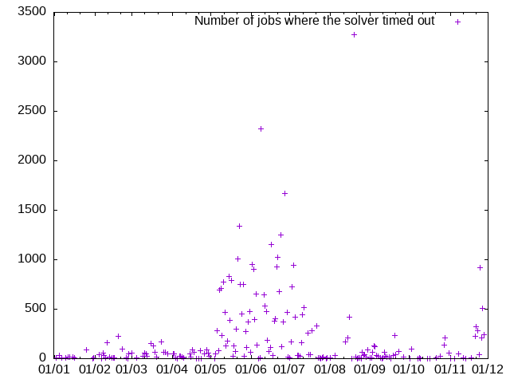

Log files for solver timeouts for 2024 (Jan - Nov)

```
for a in 2024-* ; do echo $a $(ls $a | wc -l) ; done > timeouts.txt
gnuplot -p -e 'set terminal png; set output "timeouts.png" ; set xdata time; set timefmt "%Y-%m-%d"; set xrange ["2024-01-01":"2024-12-01"]; set format x "%d/%m"; plot "timeouts.txt" using 1:2 title "Number of jobs where the solver timed out"'
```


